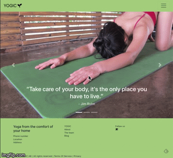

MVP of a yoga application.
Yoga platform that allows you to practice yoga with a teacher anywhere in the world.

 FEATURES 🎯

* [x] The user can create an account: student account or teacher account.
* [x] The student user can browse available yoga classes and book yoga classes.
* [x] The teacher receives a confirmation when student has booked a class.
* [x] Both student and teacher will receive an email confirmation once student has booked a class.
* [x] Responsive UI. The user can see this information clearly on devices of various screen sizes.
* [x] User login authentication with JWT Token. 
* [x] User logout authentication with JWT Token. 
* [x] The student user can search yoga class by specific time, date and yoga style.
* [x] The teacher user can create a yoga class based on the following specifications: time, date, yoga style, price and level.

